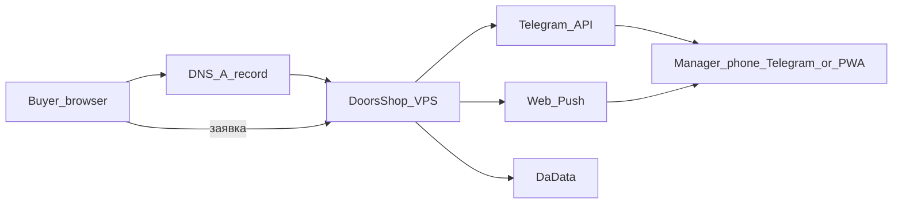
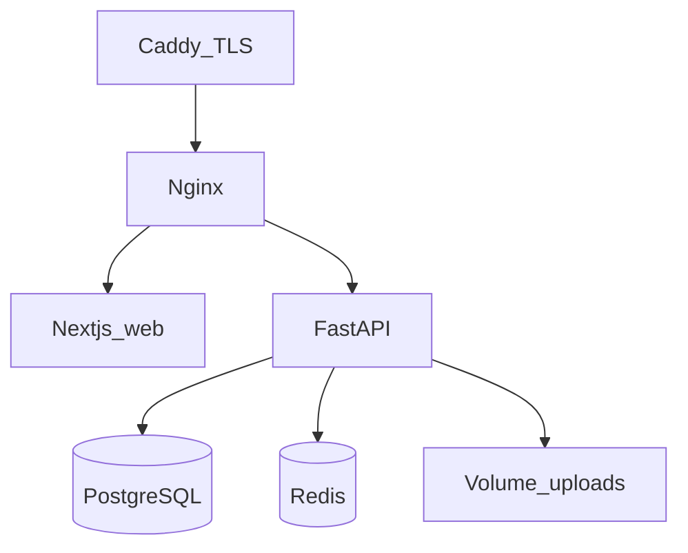

# Архитектура: Качественные двери

Модульный монолит. Один git-репозиторий, один Compose-стек, одна предметная область (каталог дверей → комплект → заявка менеджеру).

Чистую архитектуру / DDD-агрегаты на пять сервисов сюда не тащим: нет отдельной команды на «bounded context», нет нагрузки, которая это окупит. Слои API уже разделены (`routers` / `services` / `models`). Новые фичи класть в сервис, не в роутер.

## C4 — контекст

## C4 — контейнеры

## C4 — API (компоненты)

| Слой | Где | Ответственность |
| --- | --- | --- |
| HTTP | `apps/api/app/routers/` | валидация входа, коды ошибок |
| Доменные сценарии | `apps/api/app/services/` | quote комплекта, корзина, заказ, цены, seed |
| Данные | `models.py` + Alembic | товары, заявки, юзер |
| Витрина | `apps/web` | SSR каталог, конфигуратор, админка |

## Масштабирование (когда понадобится)

1. Сейчас: 1 реплика каждого сервиса.
2. Потом: N реплик `web` и `api` (stateless). Redis уже держит корзину и rate limit. Postgres — один primary.
3. Не сейчас: шардинг, Kafka, отдельный search-кластер. Полнотекст уже в Postgres (`pg_trgm` + `tsvector`).

## Контракт API

Локально: [http://localhost/docs](http://localhost/docs) (Swagger из FastAPI). Машина: `GET /openapi.json`. В production UI `/docs` выключен, схема остаётся на `/openapi.json`. Список путей: [API.md](API.md).

## Что сознательно не делаем

- Микросервисы, Kubernetes, Argo Canary, Flyway, мутационные тесты на каждый PR, Gatling в CI.
- Причины — ADR `docs/adr/0001`–`0005`.
